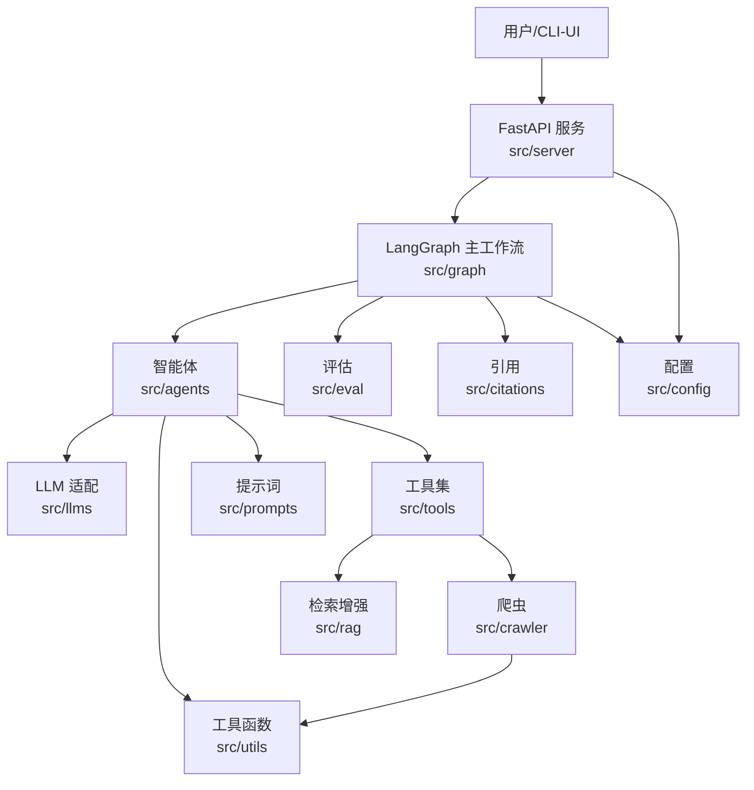

# DeerFlow API 参考索引

> 本索引汇总仓库内所有 Python 源文件的 API 参考文档，按目录分组。每个文件对应一篇 `.py.md` 文档，包含文件信息、模块概述、依赖关系、导出符号表、符号详解、调用关系与示例用法。

文档由 `scripts/gen_api_reference.py` 自动生成，覆盖 `src/`、`tests/`、`scripts/` 及根目录 Python 文件。

## 总览

- **源文件数**：170
- **代码总行数**：38,370
- **顶层符号总数**：929

## 目录分组

### 根目录

仓库根目录入口文件（控制台 UI `main.py`、FastAPI 启动 `server.py`）

共 3 个文件，详见各目录下 `README.md`：

| 源文件 | 文档 | 模块名 | 行数 | 符号数 |
|--------|------|--------|------|--------|
| `main.py` | [main.py.md](main.py.md) | `main` | 191 | 2 |
| `server.py` | [server.py.md](server.py.md) | `server` | 108 | 2 |
| `test_fix.py` | [test_fix.py.md](test_fix.py.md) | `test_fix` | 24 | 7 |

### src（根）

src 包根目录文件（`__init__.py`、`workflow.py` 编排入口）

共 2 个文件，详见各目录下 `README.md`：

| 源文件 | 文档 | 模块名 | 行数 | 符号数 |
|--------|------|--------|------|--------|
| `src/__init__.py` | [src/__init__.py.md](src/__init__.py.md) | `src` | 18 | 0 |
| `src/workflow.py` | [src/workflow.py.md](src/workflow.py.md) | `src.workflow` | 182 | 4 |

### src/agents

智能体构建与中间件（基于 LangChain 1.x `create_agent` + `AgentMiddleware`，封装动态提示词、工具拦截、模型钩子）

共 3 个文件，详见各目录下 `README.md`：

| 源文件 | 文档 | 模块名 | 行数 | 符号数 |
|--------|------|--------|------|--------|
| `src/agents/__init__.py` | [src/agents/__init__.py.md](src/agents/__init__.py.md) | `src.agents` | 12 | 0 |
| `src/agents/agents.py` | [src/agents/agents.py.md](src/agents/agents.py.md) | `src.agents.agents` | 180 | 4 |
| `src/agents/tool_interceptor.py` | [src/agents/tool_interceptor.py.md](src/agents/tool_interceptor.py.md) | `src.agents.tool_interceptor` | 253 | 3 |

### src/citations

引用元数据采集、抽取与格式化，支撑报告中的来源标注

共 5 个文件，详见各目录下 `README.md`：

| 源文件 | 文档 | 模块名 | 行数 | 符号数 |
|--------|------|--------|------|--------|
| `src/citations/__init__.py` | [src/citations/__init__.py.md](src/citations/__init__.py.md) | `src.citations` | 28 | 0 |
| `src/citations/collector.py` | [src/citations/collector.py.md](src/citations/collector.py.md) | `src.citations.collector` | 285 | 3 |
| `src/citations/extractor.py` | [src/citations/extractor.py.md](src/citations/extractor.py.md) | `src.citations.extractor` | 445 | 10 |
| `src/citations/formatter.py` | [src/citations/formatter.py.md](src/citations/formatter.py.md) | `src.citations.formatter` | 397 | 6 |
| `src/citations/models.py` | [src/citations/models.py.md](src/citations/models.py.md) | `src.citations.models` | 185 | 2 |

### src/config

配置加载（`conf.yaml` / `.env`）、模型与工具开关、报告样式、智能体映射

共 7 个文件，详见各目录下 `README.md`：

| 源文件 | 文档 | 模块名 | 行数 | 符号数 |
|--------|------|--------|------|--------|
| `src/config/__init__.py` | [src/config/__init__.py.md](src/config/__init__.py.md) | `src.config` | 57 | 2 |
| `src/config/agents.py` | [src/config/agents.py.md](src/config/agents.py.md) | `src.config.agents` | 28 | 1 |
| `src/config/configuration.py` | [src/config/configuration.py.md](src/config/configuration.py.md) | `src.config.configuration` | 91 | 3 |
| `src/config/loader.py` | [src/config/loader.py.md](src/config/loader.py.md) | `src.config.loader` | 80 | 6 |
| `src/config/questions.py` | [src/config/questions.py.md](src/config/questions.py.md) | `src.config.questions` | 34 | 2 |
| `src/config/report_style.py` | [src/config/report_style.py.md](src/config/report_style.py.md) | `src.config.report_style` | 14 | 1 |
| `src/config/tools.py` | [src/config/tools.py.md](src/config/tools.py.md) | `src.config.tools` | 43 | 5 |

### src/crawler

网页抓取与正文抽取（Jina、Readability、InfoQuest 等多客户端）

共 6 个文件，详见各目录下 `README.md`：

| 源文件 | 文档 | 模块名 | 行数 | 符号数 |
|--------|------|--------|------|--------|
| `src/crawler/__init__.py` | [src/crawler/__init__.py.md](src/crawler/__init__.py.md) | `src.crawler` | 11 | 0 |
| `src/crawler/article.py` | [src/crawler/article.py.md](src/crawler/article.py.md) | `src.crawler.article` | 55 | 1 |
| `src/crawler/crawler.py` | [src/crawler/crawler.py.md](src/crawler/crawler.py.md) | `src.crawler.crawler` | 238 | 4 |
| `src/crawler/infoquest_client.py` | [src/crawler/infoquest_client.py.md](src/crawler/infoquest_client.py.md) | `src.crawler.infoquest_client` | 153 | 2 |
| `src/crawler/jina_client.py` | [src/crawler/jina_client.py.md](src/crawler/jina_client.py.md) | `src.crawler.jina_client` | 44 | 2 |
| `src/crawler/readability_extractor.py` | [src/crawler/readability_extractor.py.md](src/crawler/readability_extractor.py.md) | `src.crawler.readability_extractor` | 31 | 2 |

### src/eval

报告评估：自动化指标（字数/引用/章节覆盖）+ LLM-as-Judge 综合评分

共 4 个文件，详见各目录下 `README.md`：

| 源文件 | 文档 | 模块名 | 行数 | 符号数 |
|--------|------|--------|------|--------|
| `src/eval/__init__.py` | [src/eval/__init__.py.md](src/eval/__init__.py.md) | `src.eval` | 21 | 0 |
| `src/eval/evaluator.py` | [src/eval/evaluator.py.md](src/eval/evaluator.py.md) | `src.eval.evaluator` | 249 | 4 |
| `src/eval/llm_judge.py` | [src/eval/llm_judge.py.md](src/eval/llm_judge.py.md) | `src.eval.llm_judge` | 282 | 7 |
| `src/eval/metrics.py` | [src/eval/metrics.py.md](src/eval/metrics.py.md) | `src.eval.metrics` | 229 | 10 |

### src/graph

LangGraph 主工作流：节点、状态、边、checkpoint、工具函数

共 6 个文件，详见各目录下 `README.md`：

| 源文件 | 文档 | 模块名 | 行数 | 符号数 |
|--------|------|--------|------|--------|
| `src/graph/__init__.py` | [src/graph/__init__.py.md](src/graph/__init__.py.md) | `src.graph` | 11 | 0 |
| `src/graph/builder.py` | [src/graph/builder.py.md](src/graph/builder.py.md) | `src.graph.builder` | 93 | 5 |
| `src/graph/checkpoint.py` | [src/graph/checkpoint.py.md](src/graph/checkpoint.py.md) | `src.graph.checkpoint` | 395 | 2 |
| `src/graph/nodes.py` | [src/graph/nodes.py.md](src/graph/nodes.py.md) | `src.graph.nodes` | 1507 | 21 |
| `src/graph/types.py` | [src/graph/types.py.md](src/graph/types.py.md) | `src.graph.types` | 50 | 1 |
| `src/graph/utils.py` | [src/graph/utils.py.md](src/graph/utils.py.md) | `src.graph.utils` | 115 | 6 |

### src/llms

LLM 适配层（统一封装 dashscope 等提供商，按类型路由）

共 3 个文件，详见各目录下 `README.md`：

| 源文件 | 文档 | 模块名 | 行数 | 符号数 |
|--------|------|--------|------|--------|
| `src/llms/__init__.py` | [src/llms/__init__.py.md](src/llms/__init__.py.md) | `src.llms` | 7 | 0 |
| `src/llms/llm.py` | [src/llms/llm.py.md](src/llms/llm.py.md) | `src.llms.llm` | 347 | 11 |
| `src/llms/providers/dashscope.py` | [src/llms/providers/dashscope.py.md](src/llms/providers/dashscope.py.md) | `src.llms.providers.dashscope` | 327 | 3 |

### src/podcast

播客生成子图（脚本撰写 → TTS → 音频合成）

共 6 个文件，详见各目录下 `README.md`：

| 源文件 | 文档 | 模块名 | 行数 | 符号数 |
|--------|------|--------|------|--------|
| `src/podcast/graph/audio_mixer_node.py` | [src/podcast/graph/audio_mixer_node.py.md](src/podcast/graph/audio_mixer_node.py.md) | `src.podcast.graph.audio_mixer_node` | 22 | 2 |
| `src/podcast/graph/builder.py` | [src/podcast/graph/builder.py.md](src/podcast/graph/builder.py.md) | `src.podcast.graph.builder` | 46 | 2 |
| `src/podcast/graph/script_writer_node.py` | [src/podcast/graph/script_writer_node.py.md](src/podcast/graph/script_writer_node.py.md) | `src.podcast.graph.script_writer_node` | 65 | 2 |
| `src/podcast/graph/state.py` | [src/podcast/graph/state.py.md](src/podcast/graph/state.py.md) | `src.podcast.graph.state` | 28 | 1 |
| `src/podcast/graph/tts_node.py` | [src/podcast/graph/tts_node.py.md](src/podcast/graph/tts_node.py.md) | `src.podcast.graph.tts_node` | 54 | 3 |
| `src/podcast/types.py` | [src/podcast/types.py.md](src/podcast/types.py.md) | `src.podcast.types` | 23 | 2 |

### src/ppt

PPT 生成子图（大纲生成器 + 内容编排器）

共 4 个文件，详见各目录下 `README.md`：

| 源文件 | 文档 | 模块名 | 行数 | 符号数 |
|--------|------|--------|------|--------|
| `src/ppt/graph/builder.py` | [src/ppt/graph/builder.py.md](src/ppt/graph/builder.py.md) | `src.ppt.graph.builder` | 38 | 2 |
| `src/ppt/graph/ppt_composer_node.py` | [src/ppt/graph/ppt_composer_node.py.md](src/ppt/graph/ppt_composer_node.py.md) | `src.ppt.graph.ppt_composer_node` | 40 | 2 |
| `src/ppt/graph/ppt_generator_node.py` | [src/ppt/graph/ppt_generator_node.py.md](src/ppt/graph/ppt_generator_node.py.md) | `src.ppt.graph.ppt_generator_node` | 31 | 2 |
| `src/ppt/graph/state.py` | [src/ppt/graph/state.py.md](src/ppt/graph/state.py.md) | `src.ppt.graph.state` | 26 | 1 |

### src/prompt_enhancer

提示词增强子图（对用户输入做扩写/优化）

共 4 个文件，详见各目录下 `README.md`：

| 源文件 | 文档 | 模块名 | 行数 | 符号数 |
|--------|------|--------|------|--------|
| `src/prompt_enhancer/__init__.py` | [src/prompt_enhancer/__init__.py.md](src/prompt_enhancer/__init__.py.md) | `src.prompt_enhancer` | 4 | 0 |
| `src/prompt_enhancer/graph/builder.py` | [src/prompt_enhancer/graph/builder.py.md](src/prompt_enhancer/graph/builder.py.md) | `src.prompt_enhancer.graph.builder` | 31 | 1 |
| `src/prompt_enhancer/graph/enhancer_node.py` | [src/prompt_enhancer/graph/enhancer_node.py.md](src/prompt_enhancer/graph/enhancer_node.py.md) | `src.prompt_enhancer.graph.enhancer_node` | 91 | 2 |
| `src/prompt_enhancer/graph/state.py` | [src/prompt_enhancer/graph/state.py.md](src/prompt_enhancer/graph/state.py.md) | `src.prompt_enhancer.graph.state` | 21 | 1 |

### src/prompts

Jinja2 提示词模板与 Plan/Step 数据模型

共 3 个文件，详见各目录下 `README.md`：

| 源文件 | 文档 | 模块名 | 行数 | 符号数 |
|--------|------|--------|------|--------|
| `src/prompts/__init__.py` | [src/prompts/__init__.py.md](src/prompts/__init__.py.md) | `src.prompts` | 14 | 0 |
| `src/prompts/planner_model.py` | [src/prompts/planner_model.py.md](src/prompts/planner_model.py.md) | `src.prompts.planner_model` | 66 | 3 |
| `src/prompts/template.py` | [src/prompts/template.py.md](src/prompts/template.py.md) | `src.prompts.template` | 117 | 4 |

### src/prose

散文编辑子图（改写 improve、扩写 longer、缩写 shorter、修复 fix、续写 continue、精简 zap）

共 8 个文件，详见各目录下 `README.md`：

| 源文件 | 文档 | 模块名 | 行数 | 符号数 |
|--------|------|--------|------|--------|
| `src/prose/graph/builder.py` | [src/prose/graph/builder.py.md](src/prose/graph/builder.py.md) | `src.prose.graph.builder` | 75 | 3 |
| `src/prose/graph/prose_continue_node.py` | [src/prose/graph/prose_continue_node.py.md](src/prose/graph/prose_continue_node.py.md) | `src.prose.graph.prose_continue_node` | 31 | 2 |
| `src/prose/graph/prose_fix_node.py` | [src/prose/graph/prose_fix_node.py.md](src/prose/graph/prose_fix_node.py.md) | `src.prose.graph.prose_fix_node` | 32 | 2 |
| `src/prose/graph/prose_improve_node.py` | [src/prose/graph/prose_improve_node.py.md](src/prose/graph/prose_improve_node.py.md) | `src.prose.graph.prose_improve_node` | 32 | 2 |
| `src/prose/graph/prose_longer_node.py` | [src/prose/graph/prose_longer_node.py.md](src/prose/graph/prose_longer_node.py.md) | `src.prose.graph.prose_longer_node` | 32 | 2 |
| `src/prose/graph/prose_shorter_node.py` | [src/prose/graph/prose_shorter_node.py.md](src/prose/graph/prose_shorter_node.py.md) | `src.prose.graph.prose_shorter_node` | 32 | 2 |
| `src/prose/graph/prose_zap_node.py` | [src/prose/graph/prose_zap_node.py.md](src/prose/graph/prose_zap_node.py.md) | `src.prose.graph.prose_zap_node` | 35 | 2 |
| `src/prose/graph/state.py` | [src/prose/graph/state.py.md](src/prose/graph/state.py.md) | `src.prose.graph.state` | 27 | 1 |

### src/rag

检索增强生成：多后端适配（Milvus / Qdrant / Dify / Ragflow / VikingDB / Moi）+ Builder 工厂

共 9 个文件，详见各目录下 `README.md`：

| 源文件 | 文档 | 模块名 | 行数 | 符号数 |
|--------|------|--------|------|--------|
| `src/rag/__init__.py` | [src/rag/__init__.py.md](src/rag/__init__.py.md) | `src.rag` | 32 | 0 |
| `src/rag/builder.py` | [src/rag/builder.py.md](src/rag/builder.py.md) | `src.rag.builder` | 36 | 1 |
| `src/rag/dify.py` | [src/rag/dify.py.md](src/rag/dify.py.md) | `src.rag.dify` | 158 | 2 |
| `src/rag/milvus.py` | [src/rag/milvus.py.md](src/rag/milvus.py.md) | `src.rag.milvus` | 983 | 5 |
| `src/rag/moi.py` | [src/rag/moi.py.md](src/rag/moi.py.md) | `src.rag.moi` | 182 | 1 |
| `src/rag/qdrant.py` | [src/rag/qdrant.py.md](src/rag/qdrant.py.md) | `src.rag.qdrant` | 531 | 5 |
| `src/rag/ragflow.py` | [src/rag/ragflow.py.md](src/rag/ragflow.py.md) | `src.rag.ragflow` | 163 | 2 |
| `src/rag/retriever.py` | [src/rag/retriever.py.md](src/rag/retriever.py.md) | `src.rag.retriever` | 164 | 4 |
| `src/rag/vikingdb_knowledge_base.py` | [src/rag/vikingdb_knowledge_base.py.md](src/rag/vikingdb_knowledge_base.py.md) | `src.rag.vikingdb_knowledge_base` | 325 | 2 |

### src/server

FastAPI 服务层（chat / config / eval / mcp / rag 路由 + 校验工具）

共 9 个文件，详见各目录下 `README.md`：

| 源文件 | 文档 | 模块名 | 行数 | 符号数 |
|--------|------|--------|------|--------|
| `src/server/__init__.py` | [src/server/__init__.py.md](src/server/__init__.py.md) | `src.server` | 11 | 0 |
| `src/server/app.py` | [src/server/app.py.md](src/server/app.py.md) | `src.server.app` | 1313 | 34 |
| `src/server/chat_request.py` | [src/server/chat_request.py.md](src/server/chat_request.py.md) | `src.server.chat_request` | 138 | 8 |
| `src/server/config_request.py` | [src/server/config_request.py.md](src/server/config_request.py.md) | `src.server.config_request` | 19 | 1 |
| `src/server/eval_request.py` | [src/server/eval_request.py.md](src/server/eval_request.py.md) | `src.server.eval_request` | 71 | 5 |
| `src/server/mcp_request.py` | [src/server/mcp_request.py.md](src/server/mcp_request.py.md) | `src.server.mcp_request` | 146 | 2 |
| `src/server/mcp_utils.py` | [src/server/mcp_utils.py.md](src/server/mcp_utils.py.md) | `src.server.mcp_utils` | 150 | 3 |
| `src/server/mcp_validators.py` | [src/server/mcp_validators.py.md](src/server/mcp_validators.py.md) | `src.server.mcp_validators` | 532 | 16 |
| `src/server/rag_request.py` | [src/server/rag_request.py.md](src/server/rag_request.py.md) | `src.server.rag_request` | 35 | 3 |

### src/tools

工具集（搜索、爬取、TTS、Python REPL、检索器、装饰器）

共 14 个文件，详见各目录下 `README.md`：

| 源文件 | 文档 | 模块名 | 行数 | 符号数 |
|--------|------|--------|------|--------|
| `src/tools/__init__.py` | [src/tools/__init__.py.md](src/tools/__init__.py.md) | `src.tools` | 23 | 0 |
| `src/tools/crawl.py` | [src/tools/crawl.py.md](src/tools/crawl.py.md) | `src.tools.crawl` | 67 | 4 |
| `src/tools/decorators.py` | [src/tools/decorators.py.md](src/tools/decorators.py.md) | `src.tools.decorators` | 88 | 5 |
| `src/tools/infoquest_search/__init__.py` | [src/tools/infoquest_search/__init__.py.md](src/tools/infoquest_search/__init__.py.md) | `src.tools.infoquest_search` | 13 | 0 |
| `src/tools/infoquest_search/infoquest_search_api.py` | [src/tools/infoquest_search/infoquest_search_api.py.md](src/tools/infoquest_search/infoquest_search_api.py.md) | `src.tools.infoquest_search.infoquest_search_api` | 232 | 4 |
| `src/tools/infoquest_search/infoquest_search_results.py` | [src/tools/infoquest_search/infoquest_search_results.py.md](src/tools/infoquest_search/infoquest_search_results.py.md) | `src.tools.infoquest_search.infoquest_search_results` | 236 | 3 |
| `src/tools/python_repl.py` | [src/tools/python_repl.py.md](src/tools/python_repl.py.md) | `src.tools.python_repl` | 70 | 3 |
| `src/tools/retriever.py` | [src/tools/retriever.py.md](src/tools/retriever.py.md) | `src.tools.retriever` | 76 | 4 |
| `src/tools/search.py` | [src/tools/search.py.md](src/tools/search.py.md) | `src.tools.search` | 155 | 11 |
| `src/tools/search_postprocessor.py` | [src/tools/search_postprocessor.py.md](src/tools/search_postprocessor.py.md) | `src.tools.search_postprocessor` | 226 | 2 |
| `src/tools/tavily_search/__init__.py` | [src/tools/tavily_search/__init__.py.md](src/tools/tavily_search/__init__.py.md) | `src.tools.tavily_search` | 13 | 0 |
| `src/tools/tavily_search/tavily_search_api_wrapper.py` | [src/tools/tavily_search/tavily_search_api_wrapper.py.md](src/tools/tavily_search/tavily_search_api_wrapper.py.md) | `src.tools.tavily_search.tavily_search_api_wrapper` | 136 | 2 |
| `src/tools/tavily_search/tavily_search_results_with_images.py` | [src/tools/tavily_search/tavily_search_results_with_images.py.md](src/tools/tavily_search/tavily_search_results_with_images.py.md) | `src.tools.tavily_search.tavily_search_results_with_images` | 174 | 2 |
| `src/tools/tts.py` | [src/tools/tts.py.md](src/tools/tts.py.md) | `src.tools.tts` | 133 | 2 |

### src/utils

通用工具（JSON 修复、日志脱敏、上下文管理）

共 4 个文件，详见各目录下 `README.md`：

| 源文件 | 文档 | 模块名 | 行数 | 符号数 |
|--------|------|--------|------|--------|
| `src/utils/__init__.py` | [src/utils/__init__.py.md](src/utils/__init__.py.md) | `src.utils` | 6 | 0 |
| `src/utils/context_manager.py` | [src/utils/context_manager.py.md](src/utils/context_manager.py.md) | `src.utils.context_manager` | 350 | 4 |
| `src/utils/json_utils.py` | [src/utils/json_utils.py.md](src/utils/json_utils.py.md) | `src.utils.json_utils` | 212 | 5 |
| `src/utils/log_sanitizer.py` | [src/utils/log_sanitizer.py.md](src/utils/log_sanitizer.py.md) | `src.utils.log_sanitizer` | 186 | 7 |

### tests/integration

集成测试（跨组件 / 外部服务，如 crawler、nodes、template、tts）

共 5 个文件，详见各目录下 `README.md`：

| 源文件 | 文档 | 模块名 | 行数 | 符号数 |
|--------|------|--------|------|--------|
| `tests/integration/test_crawler.py` | [tests/integration/test_crawler.py.md](tests/integration/test_crawler.py.md) | `tests.integration.test_crawler` | 29 | 3 |
| `tests/integration/test_nodes.py` | [tests/integration/test_nodes.py.md](tests/integration/test_nodes.py.md) | `tests.integration.test_nodes` | 3028 | 114 |
| `tests/integration/test_template.py` | [tests/integration/test_template.py.md](tests/integration/test_template.py.md) | `tests.integration.test_template` | 144 | 9 |
| `tests/integration/test_tool_interceptor_integration.py` | [tests/integration/test_tool_interceptor_integration.py.md](tests/integration/test_tool_interceptor_integration.py.md) | `tests.integration.test_tool_interceptor_integration` | 473 | 1 |
| `tests/integration/test_tts.py` | [tests/integration/test_tts.py.md](tests/integration/test_tts.py.md) | `tests.integration.test_tts` | 247 | 1 |

### tests/unit

单元测试（按模块组织，聚焦单个类/函数的行为）

共 61 个文件，详见各目录下 `README.md`：

| 源文件 | 文档 | 模块名 | 行数 | 符号数 |
|--------|------|--------|------|--------|
| `tests/unit/agents/test_middleware.py` | [tests/unit/agents/test_middleware.py.md](tests/unit/agents/test_middleware.py.md) | `tests.unit.agents.test_middleware` | 335 | 5 |
| `tests/unit/agents/test_tool_interceptor.py` | [tests/unit/agents/test_tool_interceptor.py.md](tests/unit/agents/test_tool_interceptor.py.md) | `tests.unit.agents.test_tool_interceptor` | 434 | 2 |
| `tests/unit/agents/test_tool_interceptor_fix.py` | [tests/unit/agents/test_tool_interceptor_fix.py.md](tests/unit/agents/test_tool_interceptor_fix.py.md) | `tests.unit.agents.test_tool_interceptor_fix` | 69 | 1 |
| `tests/unit/checkpoint/postgres_mock_utils.py` | [tests/unit/checkpoint/postgres_mock_utils.py.md](tests/unit/checkpoint/postgres_mock_utils.py.md) | `tests.unit.checkpoint.postgres_mock_utils` | 153 | 3 |
| `tests/unit/checkpoint/test_checkpoint.py` | [tests/unit/checkpoint/test_checkpoint.py.md](tests/unit/checkpoint/test_checkpoint.py.md) | `tests.unit.checkpoint.test_checkpoint` | 685 | 29 |
| `tests/unit/checkpoint/test_memory_leak.py` | [tests/unit/checkpoint/test_memory_leak.py.md](tests/unit/checkpoint/test_memory_leak.py.md) | `tests.unit.checkpoint.test_memory_leak` | 46 | 2 |
| `tests/unit/citations/test_citations.py` | [tests/unit/citations/test_citations.py.md](tests/unit/citations/test_citations.py.md) | `tests.unit.citations.test_citations` | 136 | 5 |
| `tests/unit/citations/test_collector.py` | [tests/unit/citations/test_collector.py.md](tests/unit/citations/test_collector.py.md) | `tests.unit.citations.test_collector` | 289 | 1 |
| `tests/unit/citations/test_extractor.py` | [tests/unit/citations/test_extractor.py.md](tests/unit/citations/test_extractor.py.md) | `tests.unit.citations.test_extractor` | 251 | 2 |
| `tests/unit/citations/test_formatter.py` | [tests/unit/citations/test_formatter.py.md](tests/unit/citations/test_formatter.py.md) | `tests.unit.citations.test_formatter` | 423 | 5 |
| `tests/unit/citations/test_models.py` | [tests/unit/citations/test_models.py.md](tests/unit/citations/test_models.py.md) | `tests.unit.citations.test_models` | 467 | 3 |
| `tests/unit/config/test_configuration.py` | [tests/unit/config/test_configuration.py.md](tests/unit/config/test_configuration.py.md) | `tests.unit.config.test_configuration` | 183 | 15 |
| `tests/unit/config/test_loader.py` | [tests/unit/config/test_loader.py.md](tests/unit/config/test_loader.py.md) | `tests.unit.config.test_loader` | 82 | 9 |
| `tests/unit/crawler/test_article.py` | [tests/unit/crawler/test_article.py.md](tests/unit/crawler/test_article.py.md) | `tests.unit.crawler.test_article` | 113 | 12 |
| `tests/unit/crawler/test_crawler_class.py` | [tests/unit/crawler/test_crawler_class.py.md](tests/unit/crawler/test_crawler_class.py.md) | `tests.unit.crawler.test_crawler_class` | 675 | 16 |
| `tests/unit/crawler/test_infoquest_client.py` | [tests/unit/crawler/test_infoquest_client.py.md](tests/unit/crawler/test_infoquest_client.py.md) | `tests.unit.crawler.test_infoquest_client` | 230 | 1 |
| `tests/unit/crawler/test_jina_client.py` | [tests/unit/crawler/test_jina_client.py.md](tests/unit/crawler/test_jina_client.py.md) | `tests.unit.crawler.test_jina_client` | 126 | 1 |
| `tests/unit/crawler/test_readability_extractor.py` | [tests/unit/crawler/test_readability_extractor.py.md](tests/unit/crawler/test_readability_extractor.py.md) | `tests.unit.crawler.test_readability_extractor` | 104 | 1 |
| `tests/unit/eval/__init__.py` | [tests/unit/eval/__init__.py.md](tests/unit/eval/__init__.py.md) | `tests.unit.eval` | 2 | 0 |
| `tests/unit/eval/test_evaluator.py` | [tests/unit/eval/test_evaluator.py.md](tests/unit/eval/test_evaluator.py.md) | `tests.unit.eval.test_evaluator` | 489 | 7 |
| `tests/unit/eval/test_metrics.py` | [tests/unit/eval/test_metrics.py.md](tests/unit/eval/test_metrics.py.md) | `tests.unit.eval.test_metrics` | 207 | 7 |
| `tests/unit/graph/test_agent_locale_restoration.py` | [tests/unit/graph/test_agent_locale_restoration.py.md](tests/unit/graph/test_agent_locale_restoration.py.md) | `tests.unit.graph.test_agent_locale_restoration` | 241 | 2 |
| `tests/unit/graph/test_builder.py` | [tests/unit/graph/test_builder.py.md](tests/unit/graph/test_builder.py.md) | `tests.unit.graph.test_builder` | 134 | 12 |
| `tests/unit/graph/test_human_feedback_locale_fix.py` | [tests/unit/graph/test_human_feedback_locale_fix.py.md](tests/unit/graph/test_human_feedback_locale_fix.py.md) | `tests.unit.graph.test_human_feedback_locale_fix` | 317 | 2 |
| `tests/unit/graph/test_nodes_recursion_limit.py` | [tests/unit/graph/test_nodes_recursion_limit.py.md](tests/unit/graph/test_nodes_recursion_limit.py.md) | `tests.unit.graph.test_nodes_recursion_limit` | 623 | 4 |
| `tests/unit/graph/test_plan_validation.py` | [tests/unit/graph/test_plan_validation.py.md](tests/unit/graph/test_plan_validation.py.md) | `tests.unit.graph.test_plan_validation` | 491 | 4 |
| `tests/unit/graph/test_state_preservation.py` | [tests/unit/graph/test_state_preservation.py.md](tests/unit/graph/test_state_preservation.py.md) | `tests.unit.graph.test_state_preservation` | 355 | 4 |
| `tests/unit/llms/test_dashscope.py` | [tests/unit/llms/test_dashscope.py.md](tests/unit/llms/test_dashscope.py.md) | `tests.unit.llms.test_dashscope` | 305 | 13 |
| `tests/unit/llms/test_llm.py` | [tests/unit/llms/test_llm.py.md](tests/unit/llms/test_llm.py.md) | `tests.unit.llms.test_llm` | 127 | 9 |
| `tests/unit/podcast/__init__.py` | [tests/unit/podcast/__init__.py.md](tests/unit/podcast/__init__.py.md) | `tests.unit.podcast` | 2 | 0 |
| `tests/unit/podcast/test_script_writer_node.py` | [tests/unit/podcast/test_script_writer_node.py.md](tests/unit/podcast/test_script_writer_node.py.md) | `tests.unit.podcast.test_script_writer_node` | 214 | 1 |
| `tests/unit/prompt_enhancer/__init__.py` | [tests/unit/prompt_enhancer/__init__.py.md](tests/unit/prompt_enhancer/__init__.py.md) | `tests.unit.prompt_enhancer` | 2 | 0 |
| `tests/unit/prompt_enhancer/graph/__init__.py` | [tests/unit/prompt_enhancer/graph/__init__.py.md](tests/unit/prompt_enhancer/graph/__init__.py.md) | `tests.unit.prompt_enhancer.graph` | 2 | 0 |
| `tests/unit/prompt_enhancer/graph/test_builder.py` | [tests/unit/prompt_enhancer/graph/test_builder.py.md](tests/unit/prompt_enhancer/graph/test_builder.py.md) | `tests.unit.prompt_enhancer.graph.test_builder` | 156 | 1 |
| `tests/unit/prompt_enhancer/graph/test_enhancer_node.py` | [tests/unit/prompt_enhancer/graph/test_enhancer_node.py.md](tests/unit/prompt_enhancer/graph/test_enhancer_node.py.md) | `tests.unit.prompt_enhancer.graph.test_enhancer_node` | 526 | 7 |
| `tests/unit/prompt_enhancer/graph/test_state.py` | [tests/unit/prompt_enhancer/graph/test_state.py.md](tests/unit/prompt_enhancer/graph/test_state.py.md) | `tests.unit.prompt_enhancer.graph.test_state` | 107 | 7 |
| `tests/unit/rag/test_dify.py` | [tests/unit/rag/test_dify.py.md](tests/unit/rag/test_dify.py.md) | `tests.unit.rag.test_dify` | 154 | 12 |
| `tests/unit/rag/test_milvus.py` | [tests/unit/rag/test_milvus.py.md](tests/unit/rag/test_milvus.py.md) | `tests.unit.rag.test_milvus` | 930 | 50 |
| `tests/unit/rag/test_qdrant.py` | [tests/unit/rag/test_qdrant.py.md](tests/unit/rag/test_qdrant.py.md) | `tests.unit.rag.test_qdrant` | 333 | 37 |
| `tests/unit/rag/test_ragflow.py` | [tests/unit/rag/test_ragflow.py.md](tests/unit/rag/test_ragflow.py.md) | `tests.unit.rag.test_ragflow` | 165 | 14 |
| `tests/unit/rag/test_retriever.py` | [tests/unit/rag/test_retriever.py.md](tests/unit/rag/test_retriever.py.md) | `tests.unit.rag.test_retriever` | 114 | 8 |
| `tests/unit/rag/test_vikingdb_knowledge_base.py` | [tests/unit/rag/test_vikingdb_knowledge_base.py.md](tests/unit/rag/test_vikingdb_knowledge_base.py.md) | `tests.unit.rag.test_vikingdb_knowledge_base` | 540 | 10 |
| `tests/unit/server/test_app.py` | [tests/unit/server/test_app.py.md](tests/unit/server/test_app.py.md) | `tests.unit.server.test_app` | 1733 | 17 |
| `tests/unit/server/test_chat_request.py` | [tests/unit/server/test_chat_request.py.md](tests/unit/server/test_chat_request.py.md) | `tests.unit.server.test_chat_request` | 168 | 14 |
| `tests/unit/server/test_mcp_request.py` | [tests/unit/server/test_mcp_request.py.md](tests/unit/server/test_mcp_request.py.md) | `tests.unit.server.test_mcp_request` | 77 | 6 |
| `tests/unit/server/test_mcp_utils.py` | [tests/unit/server/test_mcp_utils.py.md](tests/unit/server/test_mcp_utils.py.md) | `tests.unit.server.test_mcp_utils` | 185 | 9 |
| `tests/unit/server/test_mcp_validators.py` | [tests/unit/server/test_mcp_validators.py.md](tests/unit/server/test_mcp_validators.py.md) | `tests.unit.server.test_mcp_validators` | 450 | 8 |
| `tests/unit/server/test_tool_call_chunks.py` | [tests/unit/server/test_tool_call_chunks.py.md](tests/unit/server/test_tool_call_chunks.py.md) | `tests.unit.server.test_tool_call_chunks` | 317 | 3 |
| `tests/unit/tools/test_crawl.py` | [tests/unit/tools/test_crawl.py.md](tests/unit/tools/test_crawl.py.md) | `tests.unit.tools.test_crawl` | 216 | 2 |
| `tests/unit/tools/test_decorators.py` | [tests/unit/tools/test_decorators.py.md](tests/unit/tools/test_decorators.py.md) | `tests.unit.tools.test_decorators` | 119 | 2 |
| `tests/unit/tools/test_infoquest_search_api.py` | [tests/unit/tools/test_infoquest_search_api.py.md](tests/unit/tools/test_infoquest_search_api.py.md) | `tests.unit.tools.test_infoquest_search_api` | 218 | 1 |
| `tests/unit/tools/test_infoquest_search_results.py` | [tests/unit/tools/test_infoquest_search_results.py.md](tests/unit/tools/test_infoquest_search_results.py.md) | `tests.unit.tools.test_infoquest_search_results` | 226 | 1 |
| `tests/unit/tools/test_python_repl.py` | [tests/unit/tools/test_python_repl.py.md](tests/unit/tools/test_python_repl.py.md) | `tests.unit.tools.test_python_repl` | 222 | 1 |
| `tests/unit/tools/test_search.py` | [tests/unit/tools/test_search.py.md](tests/unit/tools/test_search.py.md) | `tests.unit.tools.test_search` | 291 | 1 |
| `tests/unit/tools/test_search_postprocessor.py` | [tests/unit/tools/test_search_postprocessor.py.md](tests/unit/tools/test_search_postprocessor.py.md) | `tests.unit.tools.test_search_postprocessor` | 263 | 1 |
| `tests/unit/tools/test_tavily_search_api_wrapper.py` | [tests/unit/tools/test_tavily_search_api_wrapper.py.md](tests/unit/tools/test_tavily_search_api_wrapper.py.md) | `tests.unit.tools.test_tavily_search_api_wrapper` | 207 | 1 |
| `tests/unit/tools/test_tavily_search_results_with_images.py` | [tests/unit/tools/test_tavily_search_results_with_images.py.md](tests/unit/tools/test_tavily_search_results_with_images.py.md) | `tests.unit.tools.test_tavily_search_results_with_images` | 206 | 1 |
| `tests/unit/tools/test_tools_retriever.py` | [tests/unit/tools/test_tools_retriever.py.md](tests/unit/tools/test_tools_retriever.py.md) | `tests.unit.tools.test_tools_retriever` | 126 | 9 |
| `tests/unit/utils/test_context_manager.py` | [tests/unit/utils/test_context_manager.py.md](tests/unit/utils/test_context_manager.py.md) | `tests.unit.utils.test_context_manager` | 235 | 1 |
| `tests/unit/utils/test_json_utils.py` | [tests/unit/utils/test_json_utils.py.md](tests/unit/utils/test_json_utils.py.md) | `tests.unit.utils.test_json_utils` | 581 | 7 |
| `tests/unit/utils/test_log_sanitizer.py` | [tests/unit/utils/test_log_sanitizer.py.md](tests/unit/utils/test_log_sanitizer.py.md) | `tests.unit.utils.test_log_sanitizer` | 268 | 7 |

### tests（根）

tests 根目录下的顶层测试（如 `test_state.py`、`test_ppt_localization.py`）

共 2 个文件，详见各目录下 `README.md`：

| 源文件 | 文档 | 模块名 | 行数 | 符号数 |
|--------|------|--------|------|--------|
| `tests/test_ppt_localization.py` | [tests/test_ppt_localization.py.md](tests/test_ppt_localization.py.md) | `tests.test_ppt_localization` | 135 | 3 |
| `tests/test_state.py` | [tests/test_state.py.md](tests/test_state.py.md) | `tests.test_state` | 133 | 7 |

### scripts

仓库脚本（API 文档生成器、license 头检查等）

共 2 个文件，详见各目录下 `README.md`：

| 源文件 | 文档 | 模块名 | 行数 | 符号数 |
|--------|------|--------|------|--------|
| `scripts/gen_api_reference.py` | [scripts/gen_api_reference.py.md](scripts/gen_api_reference.py.md) | `scripts.gen_api_reference` | 1291 | 25 |
| `scripts/license_header.py` | [scripts/license_header.py.md](scripts/license_header.py.md) | `scripts.license_header` | 227 | 8 |

## 架构概览

## 子图模块

- `src/podcast/`：播客生成子图
- `src/ppt/`：PPT 生成子图
- `src/prose/`：散文编辑子图（改写/扩写/缩写/修复/续写/精简）
- `src/prompt_enhancer/`：提示词增强子图
