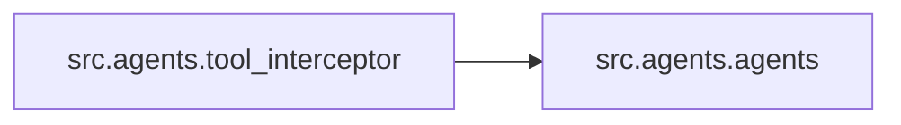

# `src/agents/` 模块索引

> 本目录下共有 3 个 Python 源文件，下表汇总了每个文件及其文档链接。

**模块定位**：智能体构建与中间件（基于 LangChain 1.x `create_agent` + `AgentMiddleware`，封装动态提示词、工具拦截、模型钩子）

| 源文件 | 文档 | 模块名 | 行数 | 顶层符号数 | 简述 |
|--------|------|--------|------|------------|------|
| `src/agents/__init__.py` | [src/agents/__init__.py.md](__init__.py.md) | `src.agents` | 12 | 0 | 智能体（agent）子包入口，统一对外暴露 create_agent 工厂函数。 |
| `src/agents/agents.py` | [src/agents/agents.py.md](agents.py.md) | `src.agents.agents` | 180 | 4 | LangChain 智能体的创建逻辑，是 agents 子包的核心实现。 |
| `src/agents/tool_interceptor.py` | [src/agents/tool_interceptor.py.md](tool_interceptor.py.md) | `src.agents.tool_interceptor` | 253 | 3 | 工具调用拦截器，用于在指定工具执行前触发 LangGraph interrupt。 |

## 目录内依赖关系

