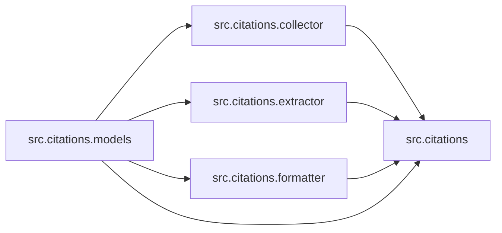

# `src/citations/` 模块索引

> 本目录下共有 5 个 Python 源文件，下表汇总了每个文件及其文档链接。

**模块定位**：引用元数据采集、抽取与格式化，支撑报告中的来源标注

| 源文件 | 文档 | 模块名 | 行数 | 顶层符号数 | 简述 |
|--------|------|--------|------|------------|------|
| `src/citations/__init__.py` | [src/citations/__init__.py.md](__init__.py.md) | `src.citations` | 28 | 0 | Citation management module for DeerFlow. |
| `src/citations/collector.py` | [src/citations/collector.py.md](collector.py.md) | `src.citations.collector` | 285 | 3 | Citation collector for gathering and managing citations d... |
| `src/citations/extractor.py` | [src/citations/extractor.py.md](extractor.py.md) | `src.citations.extractor` | 445 | 10 | Citation extraction utilities for extracting citations fr... |
| `src/citations/formatter.py` | [src/citations/formatter.py.md](formatter.py.md) | `src.citations.formatter` | 397 | 6 | Citation formatter for generating citation sections and i... |
| `src/citations/models.py` | [src/citations/models.py.md](models.py.md) | `src.citations.models` | 185 | 2 | Citation data models for structured source metadata. |

## 目录内依赖关系

