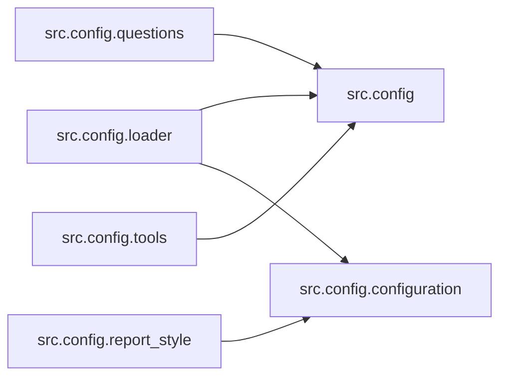

# `src/config/` 模块索引

> 本目录下共有 7 个 Python 源文件，下表汇总了每个文件及其文档链接。

**模块定位**：配置加载（`conf.yaml` / `.env`）、模型与工具开关、报告样式、智能体映射

| 源文件 | 文档 | 模块名 | 行数 | 顶层符号数 | 简述 |
|--------|------|--------|------|------------|------|
| `src/config/__init__.py` | [src/config/__init__.py.md](__init__.py.md) | `src.config` | 57 | 2 | 配置子包入口，集中加载并暴露 DeerFlow 运行所需的各项配置。 |
| `src/config/agents.py` | [src/config/agents.py.md](agents.py.md) | `src.config.agents` | 28 | 1 | 智能体与 LLM 类型的映射定义。 |
| `src/config/configuration.py` | [src/config/configuration.py.md](configuration.py.md) | `src.config.configuration` | 91 | 3 | LangGraph 运行时的可配置字段定义。 |
| `src/config/loader.py` | [src/config/loader.py.md](loader.py.md) | `src.config.loader` | 80 | 6 | 配置加载模块：读取 conf.yaml 与环境变量，提供类型化的配置访问辅助函数与 YAML 解析缓存。 |
| `src/config/questions.py` | [src/config/questions.py.md](questions.py.md) | `src.config.questions` | 34 | 2 | Built-in questions for Deer. |
| `src/config/report_style.py` | [src/config/report_style.py.md](report_style.py.md) | `src.config.report_style` | 14 | 1 | 报告样式枚举：定义最终报告支持的几种写作风格（学术、科普、新闻、社交媒体、战略投资）。 |
| `src/config/tools.py` | [src/config/tools.py.md](tools.py.md) | `src.config.tools` | 43 | 5 | 工具开关配置：定义搜索引擎、爬虫引擎、RAG 提供方的枚举，并通过环境变量读取当前选中项。 |

## 目录内依赖关系

