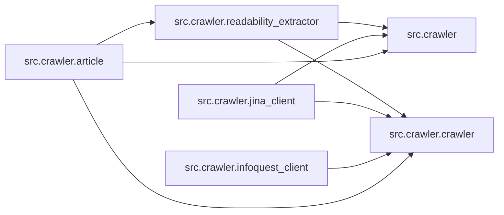

# `src/crawler/` 模块索引

> 本目录下共有 6 个 Python 源文件，下表汇总了每个文件及其文档链接。

**模块定位**：网页抓取与正文抽取（Jina、Readability、InfoQuest 等多客户端）

| 源文件 | 文档 | 模块名 | 行数 | 顶层符号数 | 简述 |
|--------|------|--------|------|------------|------|
| `src/crawler/__init__.py` | [src/crawler/__init__.py.md](__init__.py.md) | `src.crawler` | 11 | 0 | 网页爬取与正文抽取包入口：导出 ``Article``、``Crawler``、``JinaClient``、``... |
| `src/crawler/article.py` | [src/crawler/article.py.md](article.py.md) | `src.crawler.article` | 55 | 1 | 文章数据模型模块：``Article`` 封装标题与 HTML 内容，提供转 Markdown、转消息列表（含图片... |
| `src/crawler/crawler.py` | [src/crawler/crawler.py.md](crawler.py.md) | `src.crawler.crawler` | 238 | 4 | 统一爬取调度模块：``Crawler`` 依据配置在 JinaClient、ReadabilityExtracto... |
| `src/crawler/infoquest_client.py` | [src/crawler/infoquest_client.py.md](infoquest_client.py.md) | `src.crawler.infoquest_client` | 153 | 2 | Util that calls InfoQuest Crawler API. |
| `src/crawler/jina_client.py` | [src/crawler/jina_client.py.md](jina_client.py.md) | `src.crawler.jina_client` | 44 | 2 | Jina Reader 客户端模块：通过 ``https://r.jina.ai/`` 接口将给定 URL 转换为... |
| `src/crawler/readability_extractor.py` | [src/crawler/readability_extractor.py.md](readability_extractor.py.md) | `src.crawler.readability_extractor` | 31 | 2 | 正文抽取模块：``ReadabilityExtractor`` 基于 readabilipy/Readabilit... |

## 目录内依赖关系

