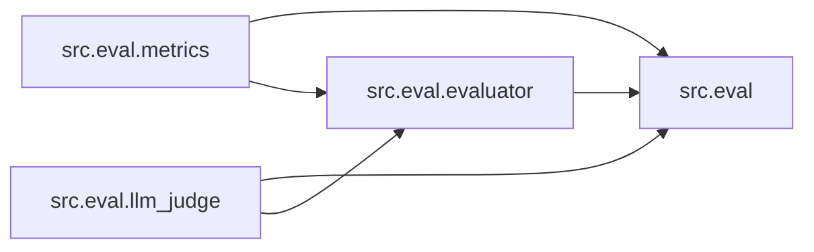

# `src/eval/` 模块索引

> 本目录下共有 4 个 Python 源文件，下表汇总了每个文件及其文档链接。

**模块定位**：报告评估：自动化指标（字数/引用/章节覆盖）+ LLM-as-Judge 综合评分

| 源文件 | 文档 | 模块名 | 行数 | 顶层符号数 | 简述 |
|--------|------|--------|------|------------|------|
| `src/eval/__init__.py` | [src/eval/__init__.py.md](__init__.py.md) | `src.eval` | 21 | 0 | Report Quality Evaluation Module for DeerFlow. |
| `src/eval/evaluator.py` | [src/eval/evaluator.py.md](evaluator.py.md) | `src.eval.evaluator` | 249 | 4 | Combined report evaluator orchestrating both automated me... |
| `src/eval/llm_judge.py` | [src/eval/llm_judge.py.md](llm_judge.py.md) | `src.eval.llm_judge` | 282 | 7 | LLM-as-Judge evaluation for report quality. |
| `src/eval/metrics.py` | [src/eval/metrics.py.md](metrics.py.md) | `src.eval.metrics` | 229 | 10 | Automated metrics for report quality evaluation. |

## 目录内依赖关系

