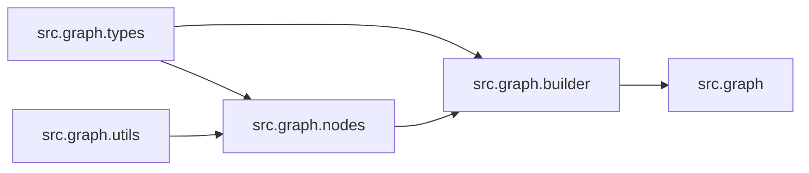

# `src/graph/` 模块索引

> 本目录下共有 6 个 Python 源文件，下表汇总了每个文件及其文档链接。

**模块定位**：LangGraph 主工作流：节点、状态、边、checkpoint、工具函数

| 源文件 | 文档 | 模块名 | 行数 | 顶层符号数 | 简述 |
|--------|------|--------|------|------------|------|
| `src/graph/__init__.py` | [src/graph/__init__.py.md](__init__.py.md) | `src.graph` | 11 | 0 | LangGraph 工作流包入口：导出 ``build_graph`` 与 ``build_graph_with_... |
| `src/graph/builder.py` | [src/graph/builder.py.md](builder.py.md) | `src.graph.builder` | 93 | 5 | LangGraph 主工作流构建模块：装配 coordinator/planner/research_team/r... |
| `src/graph/checkpoint.py` | [src/graph/checkpoint.py.md](checkpoint.py.md) | `src.graph.checkpoint` | 395 | 2 | 会话检查点与消息流管理模块：``ChatStreamManager`` 结合 InMemoryStore 与 Mo... |
| `src/graph/nodes.py` | [src/graph/nodes.py.md](nodes.py.md) | `src.graph.nodes` | 1507 | 21 | LangGraph 节点实现模块：定义 coordinator、planner、research_team、res... |
| `src/graph/types.py` | [src/graph/types.py.md](types.py.md) | `src.graph.types` | 50 | 1 | 工作流状态类型定义模块：``State`` 继承 ``MessagesState``，扩展运行时变量（locale... |
| `src/graph/utils.py` | [src/graph/utils.py.md](utils.py.md) | `src.graph.utils` | 115 | 6 | 图运行时消息工具模块：提供消息内容抽取、用户/助手消息判定、发言者名称集合等辅助函数，供节点与前端流式展示统一使用。 |

## 目录内依赖关系

