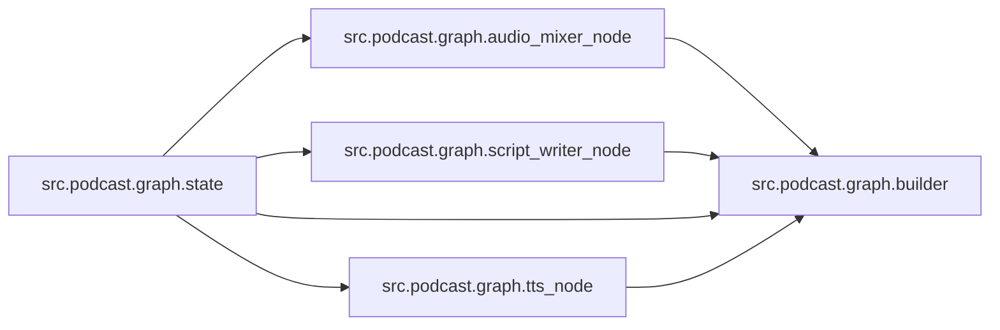

# `src/podcast/graph/` 模块索引

> 本目录下共有 5 个 Python 源文件，下表汇总了每个文件及其文档链接。

| 源文件 | 文档 | 模块名 | 行数 | 顶层符号数 | 简述 |
|--------|------|--------|------|------------|------|
| `src/podcast/graph/audio_mixer_node.py` | [src/podcast/graph/audio_mixer_node.py.md](audio_mixer_node.py.md) | `src.podcast.graph.audio_mixer_node` | 22 | 2 | 播客（Podcast）子图的音频合成节点。 |
| `src/podcast/graph/builder.py` | [src/podcast/graph/builder.py.md](builder.py.md) | `src.podcast.graph.builder` | 46 | 2 | 播客（Podcast）生成子图的构建模块。 |
| `src/podcast/graph/script_writer_node.py` | [src/podcast/graph/script_writer_node.py.md](script_writer_node.py.md) | `src.podcast.graph.script_writer_node` | 65 | 2 | 播客（Podcast）子图的脚本撰写节点。 |
| `src/podcast/graph/state.py` | [src/podcast/graph/state.py.md](state.py.md) | `src.podcast.graph.state` | 28 | 1 | 播客（Podcast）子图的状态定义。 |
| `src/podcast/graph/tts_node.py` | [src/podcast/graph/tts_node.py.md](tts_node.py.md) | `src.podcast.graph.tts_node` | 54 | 3 | 播客（Podcast）子图的文本转语音（TTS）节点。 |

## 目录内依赖关系

