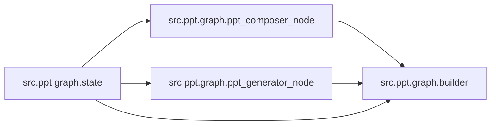

# `src/ppt/graph/` 模块索引

> 本目录下共有 4 个 Python 源文件，下表汇总了每个文件及其文档链接。

| 源文件 | 文档 | 模块名 | 行数 | 顶层符号数 | 简述 |
|--------|------|--------|------|------------|------|
| `src/ppt/graph/builder.py` | [src/ppt/graph/builder.py.md](builder.py.md) | `src.ppt.graph.builder` | 38 | 2 | PPT 生成子图的构建模块。 |
| `src/ppt/graph/ppt_composer_node.py` | [src/ppt/graph/ppt_composer_node.py.md](ppt_composer_node.py.md) | `src.ppt.graph.ppt_composer_node` | 40 | 2 | PPT 子图的内容撰写节点。 |
| `src/ppt/graph/ppt_generator_node.py` | [src/ppt/graph/ppt_generator_node.py.md](ppt_generator_node.py.md) | `src.ppt.graph.ppt_generator_node` | 31 | 2 | PPT 子图的文件生成节点。 |
| `src/ppt/graph/state.py` | [src/ppt/graph/state.py.md](state.py.md) | `src.ppt.graph.state` | 26 | 1 | PPT 子图的状态定义。 |

## 目录内依赖关系

