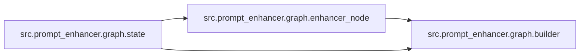

# `src/prompt_enhancer/graph/` 模块索引

> 本目录下共有 3 个 Python 源文件，下表汇总了每个文件及其文档链接。

| 源文件 | 文档 | 模块名 | 行数 | 顶层符号数 | 简述 |
|--------|------|--------|------|------------|------|
| `src/prompt_enhancer/graph/builder.py` | [src/prompt_enhancer/graph/builder.py.md](builder.py.md) | `src.prompt_enhancer.graph.builder` | 31 | 1 | Prompt 增强子图的构建模块。 |
| `src/prompt_enhancer/graph/enhancer_node.py` | [src/prompt_enhancer/graph/enhancer_node.py.md](enhancer_node.py.md) | `src.prompt_enhancer.graph.enhancer_node` | 91 | 2 | Prompt 增强子图的核心节点。 |
| `src/prompt_enhancer/graph/state.py` | [src/prompt_enhancer/graph/state.py.md](state.py.md) | `src.prompt_enhancer.graph.state` | 21 | 1 | Prompt 增强子图的状态定义。 |

## 目录内依赖关系

