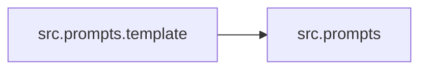

# `src/prompts/` 模块索引

> 本目录下共有 3 个 Python 源文件，下表汇总了每个文件及其文档链接。

**模块定位**：Jinja2 提示词模板与 Plan/Step 数据模型

| 源文件 | 文档 | 模块名 | 行数 | 顶层符号数 | 简述 |
|--------|------|--------|------|------------|------|
| `src/prompts/__init__.py` | [src/prompts/__init__.py.md](__init__.py.md) | `src.prompts` | 14 | 0 | Prompts 模块包。 |
| `src/prompts/planner_model.py` | [src/prompts/planner_model.py.md](planner_model.py.md) | `src.prompts.planner_model` | 66 | 3 | Planner 智能体的结构化数据模型定义。 |
| `src/prompts/template.py` | [src/prompts/template.py.md](template.py.md) | `src.prompts.template` | 117 | 4 | 提示词模板加载与渲染工具。 |

## 目录内依赖关系

