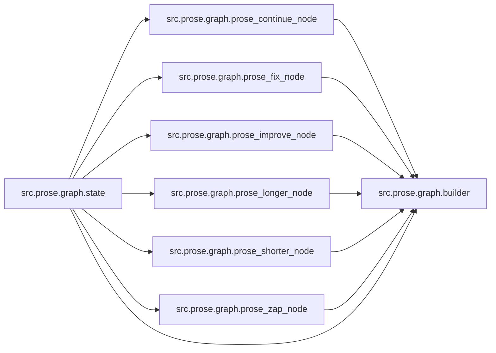

# `src/prose/graph/` 模块索引

> 本目录下共有 8 个 Python 源文件，下表汇总了每个文件及其文档链接。

| 源文件 | 文档 | 模块名 | 行数 | 顶层符号数 | 简述 |
|--------|------|--------|------|------------|------|
| `src/prose/graph/builder.py` | [src/prose/graph/builder.py.md](builder.py.md) | `src.prose.graph.builder` | 75 | 3 | 散文编辑（Prose）子图的构建模块。 |
| `src/prose/graph/prose_continue_node.py` | [src/prose/graph/prose_continue_node.py.md](prose_continue_node.py.md) | `src.prose.graph.prose_continue_node` | 31 | 2 | 散文编辑（Prose）子图的"续写"节点。 |
| `src/prose/graph/prose_fix_node.py` | [src/prose/graph/prose_fix_node.py.md](prose_fix_node.py.md) | `src.prose.graph.prose_fix_node` | 32 | 2 | 散文编辑（Prose）子图的"修复"节点。 |
| `src/prose/graph/prose_improve_node.py` | [src/prose/graph/prose_improve_node.py.md](prose_improve_node.py.md) | `src.prose.graph.prose_improve_node` | 32 | 2 | 散文编辑（Prose）子图的"改进"节点。 |
| `src/prose/graph/prose_longer_node.py` | [src/prose/graph/prose_longer_node.py.md](prose_longer_node.py.md) | `src.prose.graph.prose_longer_node` | 32 | 2 | 散文编辑（Prose）子图的"扩写"节点。 |
| `src/prose/graph/prose_shorter_node.py` | [src/prose/graph/prose_shorter_node.py.md](prose_shorter_node.py.md) | `src.prose.graph.prose_shorter_node` | 32 | 2 | 散文编辑（Prose）子图的"精简"节点。 |
| `src/prose/graph/prose_zap_node.py` | [src/prose/graph/prose_zap_node.py.md](prose_zap_node.py.md) | `src.prose.graph.prose_zap_node` | 35 | 2 | 散文编辑（Prose）子图的"自定义指令"节点。 |
| `src/prose/graph/state.py` | [src/prose/graph/state.py.md](state.py.md) | `src.prose.graph.state` | 27 | 1 | 散文编辑（Prose）子图的状态定义。 |

## 目录内依赖关系

