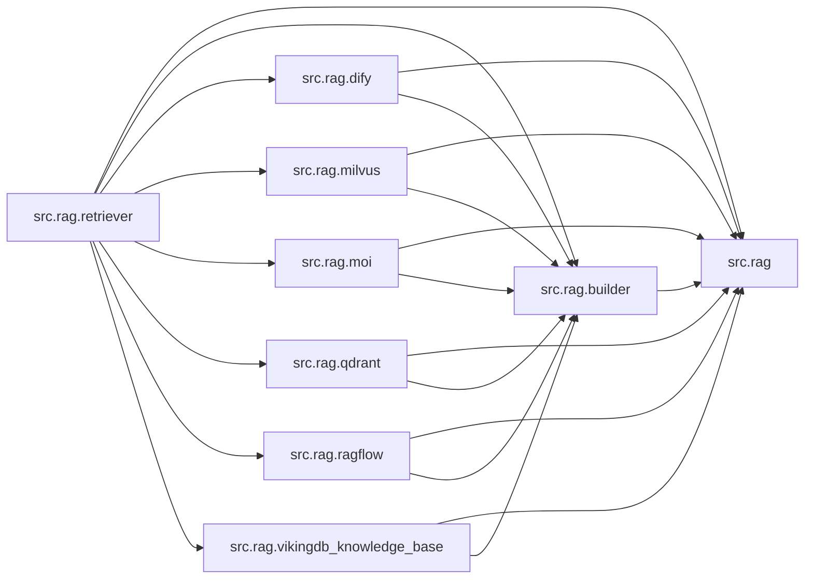

# `src/rag/` 模块索引

> 本目录下共有 9 个 Python 源文件，下表汇总了每个文件及其文档链接。

**模块定位**：检索增强生成：多后端适配（Milvus / Qdrant / Dify / Ragflow / VikingDB / Moi）+ Builder 工厂

| 源文件 | 文档 | 模块名 | 行数 | 顶层符号数 | 简述 |
|--------|------|--------|------|------------|------|
| `src/rag/__init__.py` | [src/rag/__init__.py.md](__init__.py.md) | `src.rag` | 32 | 0 | RAG（检索增强生成）模块包。 |
| `src/rag/builder.py` | [src/rag/builder.py.md](builder.py.md) | `src.rag.builder` | 36 | 1 | RAG 检索器工厂。 |
| `src/rag/dify.py` | [src/rag/dify.py.md](dify.py.md) | `src.rag.dify` | 158 | 2 | Dify RAG 平台的检索器适配实现。 |
| `src/rag/milvus.py` | [src/rag/milvus.py.md](milvus.py.md) | `src.rag.milvus` | 983 | 5 | Milvus 向量数据库的 RAG 检索器适配实现。 |
| `src/rag/moi.py` | [src/rag/moi.py.md](moi.py.md) | `src.rag.moi` | 182 | 1 | MatrixOne Intelligence (MOI) 平台的 RAG 检索器适配实现。 |
| `src/rag/qdrant.py` | [src/rag/qdrant.py.md](qdrant.py.md) | `src.rag.qdrant` | 531 | 5 | Qdrant 向量数据库的 RAG 检索器适配实现。 |
| `src/rag/ragflow.py` | [src/rag/ragflow.py.md](ragflow.py.md) | `src.rag.ragflow` | 163 | 2 | RAGFlow 平台的 RAG 检索器适配实现。 |
| `src/rag/retriever.py` | [src/rag/retriever.py.md](retriever.py.md) | `src.rag.retriever` | 164 | 4 | RAG 检索器的核心抽象与数据模型。 |
| `src/rag/vikingdb_knowledge_base.py` | [src/rag/vikingdb_knowledge_base.py.md](vikingdb_knowledge_base.py.md) | `src.rag.vikingdb_knowledge_base` | 325 | 2 | 基于火山引擎 VikingDB 知识库的检索器实现模块。 |

## 目录内依赖关系

