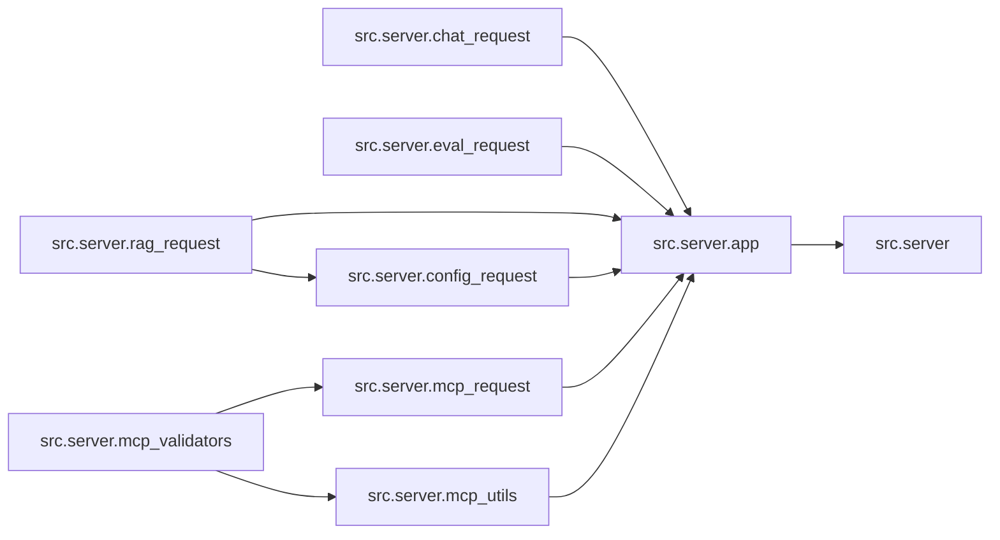

# `src/server/` 模块索引

> 本目录下共有 9 个 Python 源文件，下表汇总了每个文件及其文档链接。

**模块定位**：FastAPI 服务层（chat / config / eval / mcp / rag 路由 + 校验工具）

| 源文件 | 文档 | 模块名 | 行数 | 顶层符号数 | 简述 |
|--------|------|--------|------|------------|------|
| `src/server/__init__.py` | [src/server/__init__.py.md](__init__.py.md) | `src.server` | 11 | 0 | FastAPI 服务端包入口。 |
| `src/server/app.py` | [src/server/app.py.md](app.py.md) | `src.server.app` | 1313 | 34 | DeerFlow 主 FastAPI 应用模块。 |
| `src/server/chat_request.py` | [src/server/chat_request.py.md](chat_request.py.md) | `src.server.chat_request` | 138 | 8 | 聊天及生成相关请求体 Pydantic 模型定义。 |
| `src/server/config_request.py` | [src/server/config_request.py.md](config_request.py.md) | `src.server.config_request` | 19 | 1 | 服务端配置响应模型。 |
| `src/server/eval_request.py` | [src/server/eval_request.py.md](eval_request.py.md) | `src.server.eval_request` | 71 | 5 | Request models for report evaluation endpoint. |
| `src/server/mcp_request.py` | [src/server/mcp_request.py.md](mcp_request.py.md) | `src.server.mcp_request` | 146 | 2 | MCP 服务端元数据请求/响应模型。 |
| `src/server/mcp_utils.py` | [src/server/mcp_utils.py.md](mcp_utils.py.md) | `src.server.mcp_utils` | 150 | 3 | MCP（Model Context Protocol）工具加载工具函数。 |
| `src/server/mcp_validators.py` | [src/server/mcp_validators.py.md](mcp_validators.py.md) | `src.server.mcp_validators` | 532 | 16 | MCP Server Configuration Validators. |
| `src/server/rag_request.py` | [src/server/rag_request.py.md](rag_request.py.md) | `src.server.rag_request` | 35 | 3 | RAG 相关请求/响应 Pydantic 模型。 |

## 目录内依赖关系

