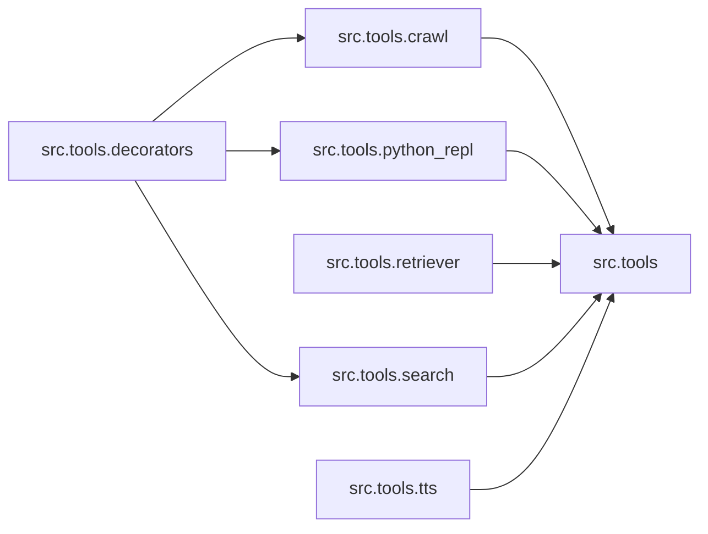

# `src/tools/` 模块索引

> 本目录下共有 8 个 Python 源文件，下表汇总了每个文件及其文档链接。

**模块定位**：工具集（搜索、爬取、TTS、Python REPL、检索器、装饰器）

| 源文件 | 文档 | 模块名 | 行数 | 顶层符号数 | 简述 |
|--------|------|--------|------|------------|------|
| `src/tools/__init__.py` | [src/tools/__init__.py.md](__init__.py.md) | `src.tools` | 23 | 0 | DeerFlow 工具集包入口。 |
| `src/tools/crawl.py` | [src/tools/crawl.py.md](crawl.py.md) | `src.tools.crawl` | 67 | 4 | 网页抓取工具。 |
| `src/tools/decorators.py` | [src/tools/decorators.py.md](decorators.py.md) | `src.tools.decorators` | 88 | 5 | 工具装饰器与日志增强辅助。 |
| `src/tools/python_repl.py` | [src/tools/python_repl.py.md](python_repl.py.md) | `src.tools.python_repl` | 70 | 3 | Python 代码执行工具。 |
| `src/tools/retriever.py` | [src/tools/retriever.py.md](retriever.py.md) | `src.tools.retriever` | 76 | 4 | 本地知识库检索工具。 |
| `src/tools/search.py` | [src/tools/search.py.md](search.py.md) | `src.tools.search` | 155 | 11 | 网络搜索工具集。 |
| `src/tools/search_postprocessor.py` | [src/tools/search_postprocessor.py.md](search_postprocessor.py.md) | `src.tools.search_postprocessor` | 226 | 2 | 搜索结果后处理器。 |
| `src/tools/tts.py` | [src/tools/tts.py.md](tts.py.md) | `src.tools.tts` | 133 | 2 | Text-to-Speech module using volcengine TTS API. |

## 目录内依赖关系

