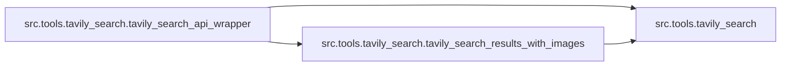

# `src/tools/tavily_search/` 模块索引

> 本目录下共有 3 个 Python 源文件，下表汇总了每个文件及其文档链接。

| 源文件 | 文档 | 模块名 | 行数 | 顶层符号数 | 简述 |
|--------|------|--------|------|------------|------|
| `src/tools/tavily_search/__init__.py` | [src/tools/tavily_search/__init__.py.md](__init__.py.md) | `src.tools.tavily_search` | 13 | 0 | Tavily 搜索工具子包。 |
| `src/tools/tavily_search/tavily_search_api_wrapper.py` | [src/tools/tavily_search/tavily_search_api_wrapper.py.md](tavily_search_api_wrapper.py.md) | `src.tools.tavily_search.tavily_search_api_wrapper` | 136 | 2 | Tavily 搜索 API 增强封装模块。 |
| `src/tools/tavily_search/tavily_search_results_with_images.py` | [src/tools/tavily_search/tavily_search_results_with_images.py.md](tavily_search_results_with_images.py.md) | `src.tools.tavily_search.tavily_search_results_with_images` | 174 | 2 | Tavily 带图像搜索的 LangChain 工具模块。 |

## 目录内依赖关系

